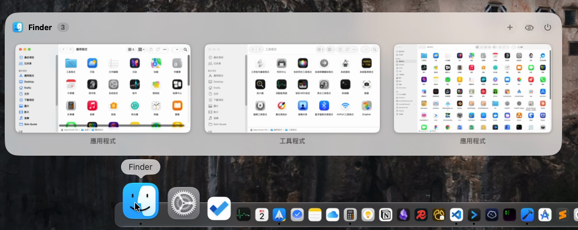
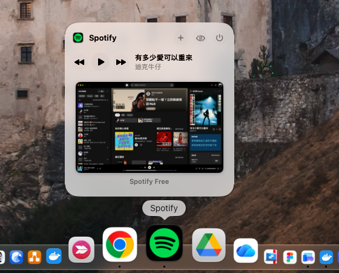

# DockLens

**Hover a Dock icon, see every window of that app.** Click a thumbnail to switch, or close / minimize / full-screen it right from the preview.

游標停在 Dock 圖示上，就能看到這個 App 的所有視窗縮圖；點縮圖直接切換，也能在預覽上關閉、縮小、全螢幕。（中文說明在下方）

> **Free and open source (GPLv3).** Every line of code is here — read it, build it yourself, or check what the permissions are used for.
>
> I'm building this on my own and want to learn what you actually need — please open an [Issue](../../issues/new/choose) with bugs or ideas.




## Features

- Live thumbnails of all windows when you hover a Dock icon; click to switch
- Traffic-light buttons on each thumbnail: close, minimize / restore, full screen
- Header actions: new window, hide app, quit app
- Single-key shortcuts while the pointer is on the preview: **W** close, **M** minimize / restore the window under the pointer, **H** hide, **Q** quit the app (other keys and ⌘ combos pass through; can be turned off in Settings)
- Shows minimized windows and windows on other Spaces — clicking one switches to that Space
- Spotify and Music get a playback bar: play / pause, previous, next, and the current song
- Calendar shows today's agenda — even when Calendar isn't running: calendar colors, "in progress" / "starts in 9 min", a **Join** button for Zoom / Meet / Teams links, click an event to open it; shows tomorrow once today is done
- Windows you closed with ✕ while the app keeps running (Notion, Slack…) stay listed — click to reopen
- Speaks your language: 34 languages, following your macOS language setting (English, 简体中文, 繁體中文, 日本語, 한국어, Deutsch, Français, Español, Italiano, Português, Русский, العربية, עברית, हिन्दी, Türkçe, Nederlands, Svenska, Polski, Українська, Tiếng Việt, ไทย, Bahasa Indonesia and more — see Settings or `DockLens/Resources/Localizable.xcstrings`). Translations were made with AI assistance and not every one has been checked by a native speaker — corrections are welcome as [issues](../../issues) or pull requests.
- Works without Screen Recording: skip it and the preview shows each window as app icon + title — switching, closing and minimizing all still work
- Dock on bottom, left or right; works with auto-hide, magnification and multiple displays



## Performance (Apple silicon, measured)

| | |
|---|---|
| Hover → preview | ~125–140 ms (includes an adjustable 120 ms hover delay) |
| Idle | 0% CPU, 0 wakeups, ~20–30 MB memory |

Event-driven — nothing polls while you're not using it.

## Under consideration — vote with 👍

I won't build these until real people ask for them. If one matters to you, 👍 the issue and tell me **how you'd use it** in a comment.

- [Alt+Tab-style window switcher](../../issues?q=is%3Aissue+label%3Aconsidering)
- [Three-finger gesture to open the preview](../../issues?q=is%3Aissue+label%3Aconsidering)
- [Windows-style taskbar](../../issues?q=is%3Aissue+label%3Aconsidering)
- [Support for macOS older than 26](../../issues?q=is%3Aissue+label%3Aconsidering)

## Privacy

DockLens makes **no network connections** unless you ask it to check for updates. Thumbnails are captured and shown locally and never leave your Mac.
The only connection it can make is the update check — one request to the GitHub API to read the latest version number, sent only when you click **Check for Updates** or turn on **Check weekly** in Settings (off by default). No data about you is sent.
Don't take my word for it: the code that uses each permission lives in [`DockLens/Core`](DockLens/Core) — `DockObserver.swift` (Accessibility: which Dock icon you're hovering), `ThumbnailService.swift` (Screen Recording: thumbnails), `MediaController.swift` (Automation: Spotify / Music), `CalendarAgenda.swift` (Calendars: read-only agenda), and the update check in `UpdateChecker.swift`. You can also confirm there's no other network traffic with a firewall such as Little Snitch or LuLu.

## Requirements

macOS 26 or later.

## Install

1. Download `DockLens.zip` from [Releases](../../releases/latest) and unzip it.
2. Move `DockLens.app` to `/Applications`.
3. Open it. macOS will block it the first time, because DockLens isn't notarized by Apple yet:
   - Open **System Settings → Privacy & Security**, scroll down, click **Open Anyway** next to *"DockLens" was blocked to protect your Mac.*
4. Grant the permissions the onboarding asks for:
   - **Accessibility** (required) — to know which Dock icon you're hovering and to switch / close windows
   - **Screen Recording** (optional) — to capture window thumbnails (local only). Without it, the preview lists windows by app icon and title instead; you can turn thumbnails on later in Settings
   - **Automation** (optional) — asked only the first time you press play on Spotify or Music
   - **Calendars** (optional) — asked only when you click **Allow** on the Calendar preview

### Updating

Replace `DockLens.app` in `/Applications` with the new one. From 1.0.4 on, releases are signed with the same certificate, so **your permissions are kept** — you only click **Open Anyway** once for the new version.
To hear about new versions: choose **Check for Updates…** in the menu bar menu, turn on **Check weekly** in Settings, or click **Watch → Custom → Releases** at the top of this GitHub page.

## Build from source

Requires Xcode 26 and [XcodeGen](https://github.com/yonaskolb/XcodeGen) (`brew install xcodegen`).

```sh
git clone https://github.com/firstfu/DockLens-app.git && cd DockLens-app
xcodegen generate
xcodebuild -project DockLens.xcodeproj -scheme DockLens -configuration Release -derivedDataPath build build
open build/Build/Products/Release/DockLens.app
```

No Apple account needed — builds are ad-hoc signed by default. To sign with your own certificate (so macOS keeps the permissions across rebuilds), see [`Config/Signing.xcconfig`](Config/Signing.xcconfig).
Tests: replace `build` with `test` in the `xcodebuild` command.

## License

[GPLv3](LICENSE). You're free to use, study, modify and share it; modified versions you distribute must stay open source under the same license.

---

## 中文說明

**免費、開源（GPLv3）。**所有程式碼都在這裡，可以自己看、自己建置，確認權限拿來做什麼。

這是我一個人開發的小工具，想知道大家真正需要什麼——有問題或想要的功能，請開 [Issue](../../issues/new/choose) 告訴我。

### 功能

- 游標停在 Dock 圖示上，即時顯示該 App 所有視窗的縮圖，點縮圖切換
- 縮圖上的紅黃綠按鈕：關閉、縮到 Dock／還原、全螢幕
- 游標在預覽上時可用單鍵操作：**W** 關閉、**M** 縮小／還原游標所在的視窗，**H** 隱藏、**Q** 結束 App（其他鍵與 ⌘ 組合鍵照常輸入；可在設定關閉）
- 標頭：開新視窗、隱藏 App、結束 App
- 會列出已縮小的視窗、其他桌面（Space）上的視窗，點一下會切到那個桌面
- Spotify 與音樂多一條播放列：播放／暫停、上一首、下一首，並顯示目前的歌曲
- 行事曆顯示今天的行程（行事曆沒開也行）：日曆顏色、「進行中／9 分鐘後開始」、Zoom／Meet／Teams 連結一鍵「加入」、點行程直接打開；今天結束後改顯示明天
- 按 ✕ 關掉但 App 還開著的視窗（Notion、Slack 等）會保留在預覽裡，點一下重新打開
- 支援 34 種語言，跟隨 macOS 的語言設定（English、简体中文、繁體中文、日本語、한국어、Deutsch、Français、Español、Русский、العربية、हिन्दी、Türkçe、Tiếng Việt、ไทย 等，完整清單見 `DockLens/Resources/Localizable.xcstrings`）。翻譯由 AI 協助完成，不是每一種都經過母語者檢查，歡迎用 [issue](../../issues) 或 pull request 指正
- 不給螢幕錄製也能用：預覽改以 App 圖示＋視窗標題顯示，切換、關閉、縮小照常可用
- Dock 放底部、左側、右側都能用；支援自動隱藏、放大效果、多螢幕

### 考慮中的功能：請用 👍 投票

這些功能我**不會預先做**，要有人真的需要才做。如果有一項對你重要，請到對應的 Issue 按 👍，並留言說明**你會怎麼用**。

- Alt+Tab 式視窗切換、三指手勢開啟預覽、Windows 式工作列、支援 macOS 26 以前的系統
  （清單見 [Issues](../../issues?q=is%3Aissue+label%3Aconsidering)）

### 隱私

除非你要它檢查更新，DockLens **不會連網**。縮圖只在你的 Mac 上擷取與顯示，不會上傳。
唯一可能的連線是檢查更新：向 GitHub API 發一個請求讀取最新版本號，只在你按「檢查更新」或在設定打開「每週自動檢查更新」（預設關閉）時才發出，不送出任何關於你的資料。
不用只聽我說：用到各權限的程式碼都在 [`DockLens/Core`](DockLens/Core)——`DockObserver.swift`（輔助使用：偵測游標停在哪個 Dock 圖示）、`ThumbnailService.swift`（螢幕錄製：縮圖）、`MediaController.swift`（自動化：Spotify／音樂）、`CalendarAgenda.swift`（行事曆：唯讀讀取行程），檢查更新在 `UpdateChecker.swift`。也可以用 Little Snitch、LuLu 等防火牆確認它沒有其他網路連線。

### 系統需求

macOS 26 以上。

### 安裝

1. 從 [Releases](../../releases/latest) 下載 `DockLens.zip` 並解壓縮
2. 把 `DockLens.app` 拖進「應用程式」資料夾
3. 打開它。第一次會被系統擋下（DockLens 還沒經過 Apple 公證）：
   到 **系統設定 → 隱私權與安全性**，往下捲，找到「已阻擋『DockLens』以保護你的Mac。」這行，按旁邊的 **強制打開**
4. 依引導開啟權限：
   - **輔助使用**（必要）：偵測游標停在哪個 Dock 圖示、切換與關閉視窗
   - **螢幕錄製**（選用）：擷取視窗縮圖（只在本機處理）。不給的話，預覽改以 App 圖示和視窗標題列出視窗，之後可在設定裡開啟縮圖
   - **自動化**（選用）：第一次在 Spotify 或音樂按播放鈕時才會詢問
   - **行事曆**（選用）：在行事曆的預覽上按「允許」時才會詢問

### 更新

用新的 `DockLens.app` 取代「應用程式」裡的舊版。從 1.0.4 起，每個版本都用同一張憑證簽章，**系統權限會保留**，新版只需要再按一次「強制打開」。
想知道有新版本：在選單列選單按「檢查更新…」、在設定打開「每週自動檢查更新」，或在這個 GitHub 頁面上方按 **Watch → Custom → Releases** 訂閱。

### 從原始碼建置

需要 Xcode 26 與 [XcodeGen](https://github.com/yonaskolb/XcodeGen)（`brew install xcodegen`），指令見上方英文的 **Build from source**。
預設為 ad-hoc 簽章，不需要 Apple 帳號；想用自己的憑證（重建後系統權限不必重開），請看 [`Config/Signing.xcconfig`](Config/Signing.xcconfig)。

### 授權

[GPLv3](LICENSE)：可自由使用、研究、修改與散布；散布修改後的版本時，必須以同樣授權開源。
