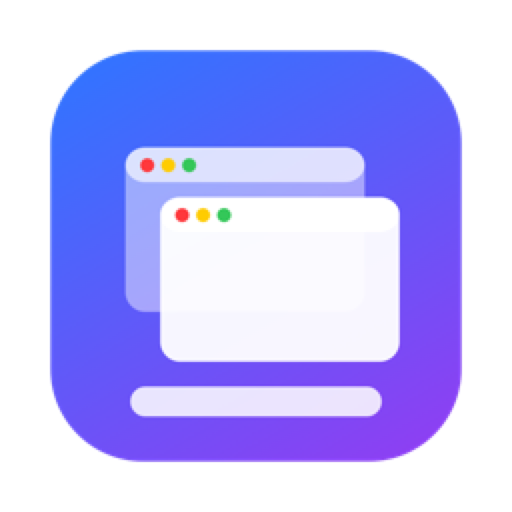
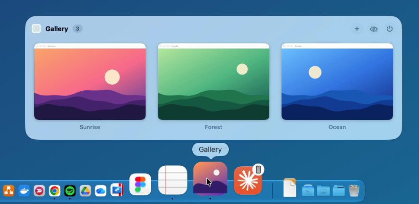
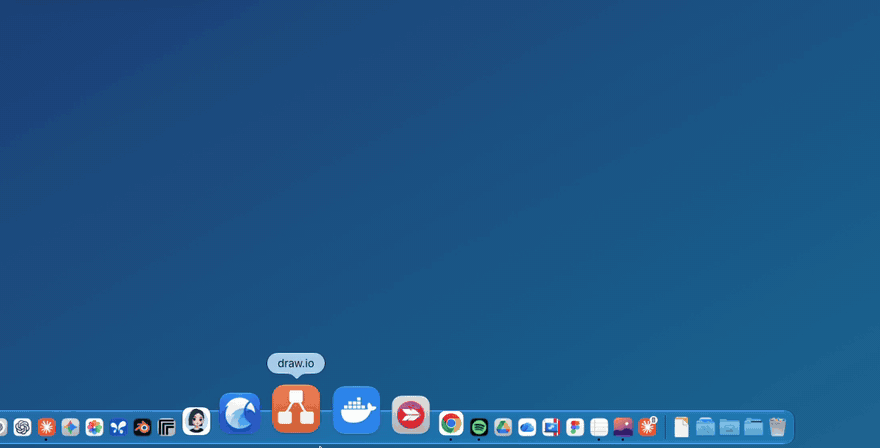
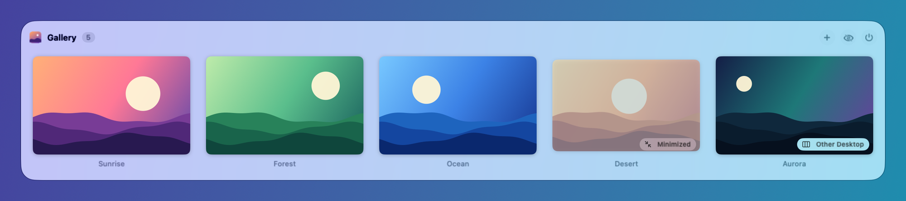
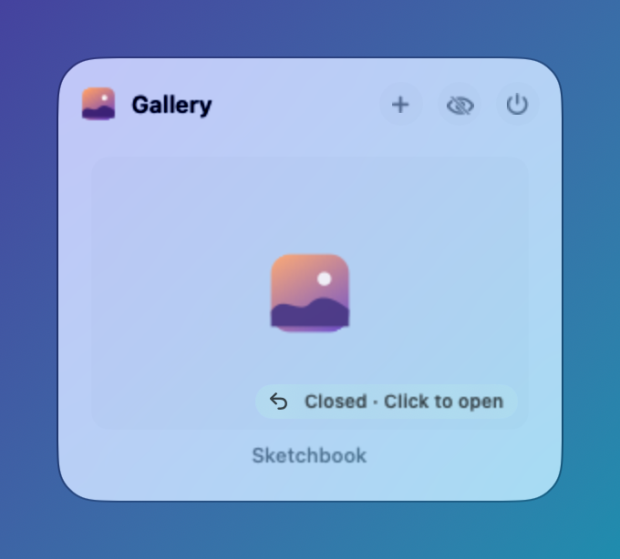
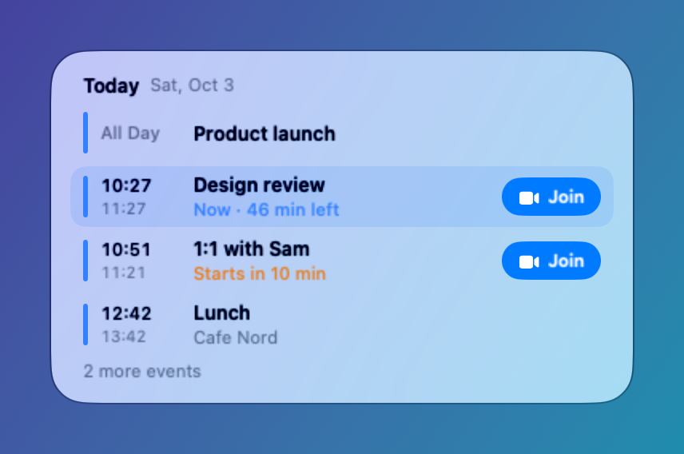
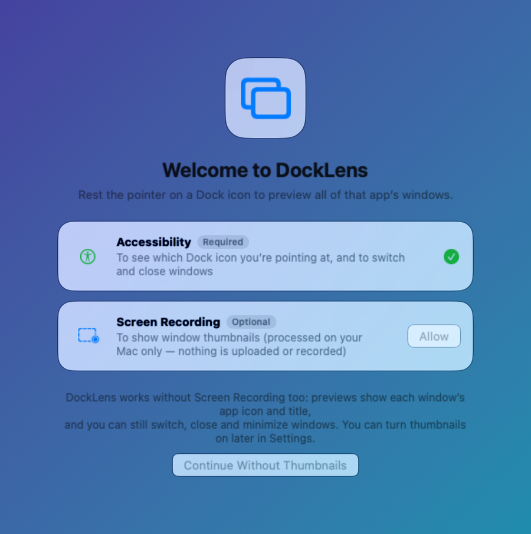
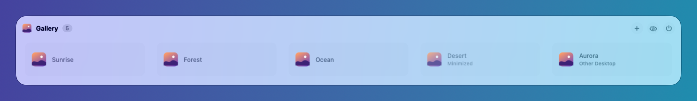
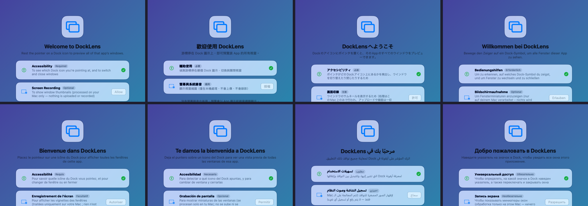

<p align="center">
  
</p>

<h1 align="center">DockLens</h1>

<p align="center">
  <b>Hover a Dock icon, see every window of that app.</b><br>
  Live thumbnails. Click to switch, or close, minimize and full-screen right from the preview.<br>
  Free and open source (GPLv3).
</p>

<p align="center">
  English · <a href="README.zh-TW.md">繁體中文</a>
</p>

<p align="center">
  <a href="../../releases/latest"></a>
  
  <a href="LICENSE"></a>
</p>

<p align="center">
  <a href="../../releases/latest"><b>Download DockLens.zip</b></a>
  &nbsp;·&nbsp;
  <code>brew install --cask firstfu/tap/docklens</code>
</p>

> [!NOTE]
> DockLens needs **macOS 26 or later**. It is **not notarized by Apple yet**, so macOS blocks the first launch: open System Settings → Privacy & Security and click **Open Anyway** once ([steps](#install)). All the code is here, and [what each permission is used for](#privacy) is spelled out below.

<p align="center">
  
</p>

## See it in action

<p align="center">
  
  <br>
  <sub>Hover a Dock icon, click a thumbnail to switch, close or minimize from the preview.</sub>
</p>

<p align="center">
  
  <br>
  <sub>Minimized windows and windows on other desktops are labeled; click one to jump straight to it.</sub>
</p>

<table>
  <tr>
    <td width="50%" align="center"><br><sub><b>Closed with ✕ but the app is still running?</b><br>Notion, Slack and similar apps keep the window in the list; one click reopens it.</sub></td>
    <td width="50%" align="center"><br><sub><b>Calendar agenda.</b><br>Today, then tomorrow. “Now”, “starts in 10 min”, and a Join button for Zoom, Meet and Teams links.</sub></td>
  </tr>
  <tr>
    <td align="center"><br><sub><b>Playback bar</b> for Spotify and Music: play / pause, previous, next, current song.</sub></td>
    <td align="center"><br><sub><b>Screen Recording is optional.</b><br>Skip it and the preview lists each window by app icon and title.</sub></td>
  </tr>
</table>

<p align="center">
  
  <br>
  <sub>Without Screen Recording, switching, closing and minimizing still work.</sub>
</p>

## Install

**Homebrew** (a [personal tap](https://github.com/firstfu/homebrew-tap)):

```sh
brew install --cask firstfu/tap/docklens
```

**Or download manually:**

1. Download `DockLens.zip` from [Releases](../../releases/latest) and unzip it.
2. Move `DockLens.app` to `/Applications`.
3. Open it. macOS blocks the first launch because DockLens isn't notarized yet: open **System Settings → Privacy & Security**, scroll down and click **Open Anyway** next to *"DockLens" was blocked to protect your Mac.* You only do this once per version.
4. Allow the permissions the welcome window asks for (see the table below).

Requires **macOS 26 or later**. The app is a universal binary (Apple silicon and Intel).

### Updating

Replace `DockLens.app` in `/Applications` with the new one, or run `brew upgrade --cask docklens` once the tap is updated. From 1.0.4 on, releases are signed with the same certificate, so **your permissions are kept**; you only click **Open Anyway** once for the new version.
To hear about new versions: choose **Check for Updates…** in the menu bar menu, turn on **Check weekly** in Settings, or use **Watch → Custom → Releases** on this page.

## Permissions at a glance

| Permission | Needed? | Why | If you skip it |
|---|---|---|---|
| **Accessibility** | Required | Know which Dock icon you are hovering; switch and close windows | DockLens can't work |
| **Screen Recording** | Optional | Show live thumbnails (processed on your Mac only) | The preview lists windows by app icon and title |
| **Automation** (Spotify / Music) | Optional | Playback bar | No playback bar; asked only when you first press play |
| **Calendars** | Optional | Today's agenda on the Calendar icon | No agenda; asked only when you click **Allow** there |

## Features

- Live thumbnails of every window of an app when you hover its Dock icon; click to switch
- Close, minimize / restore or full-screen from the preview; header buttons for new window, hide app, quit app
- Shows minimized windows and windows on other Spaces (clicking one switches to that Space)
- Windows closed with ✕ in apps that keep running (Notion, Slack…) stay listed; click to reopen
- **Recently closed**: documents you just closed in an app (TextEdit, Preview and other file-based apps) are listed at the bottom of its preview; click to reopen the file
- Calendar agenda (today, then tomorrow) with a Join button, even when Calendar isn't running
- Spotify and Music playback bar
- Works without Screen Recording (icon + title list)
- Dock at the bottom, left or right; auto-hide, magnification and multiple displays
- [34 languages](#languages), following your macOS language setting
- Event-driven: 0% CPU and no wakeups when idle (~20–30 MB memory, Apple silicon, measured)

<details>
<summary>Single-key shortcuts on the preview</summary>

While the pointer is on the preview: **W** closes the window under the pointer, **M** minimizes / restores it, **H** hides the app, **Q** quits it. Other keys and ⌘ combinations pass through unchanged. Turn it off in Settings if you don't want it.
</details>

## Privacy

DockLens makes **no network connections** unless you ask it to check for updates. Thumbnails are captured and shown locally and never leave your Mac.
The only connection it can make is the update check: one request to the GitHub API to read the latest version number, sent only when you click **Check for Updates** or turn on **Check weekly** in Settings (off by default). No data about you is sent.

The **Recently closed** list (names of documents you closed) is kept in memory only: never written to disk, never sent anywhere, and gone when DockLens quits. Only files are remembered, not web pages. Turn it off in Settings and it is cleared immediately.

Don't take my word for it: the code that uses each permission lives in [`DockLens/Core`](DockLens/Core): `DockObserver.swift` (Accessibility: which Dock icon you're hovering), `ThumbnailService.swift` (Screen Recording: thumbnails), `MediaController.swift` (Automation: Spotify / Music), `CalendarAgenda.swift` (Calendars: read-only agenda), `ClosedWindowStore.swift` / `ClosedWindowWatcher.swift` (the in-memory Recently closed list), and the update check in `UpdateChecker.swift`. You can also confirm there's no other network traffic with a firewall such as Little Snitch or LuLu.

## FAQ

<details>
<summary><b>The preview doesn't appear when I hover a Dock icon</b></summary>

1. Check that **Accessibility** is allowed: System Settings → Privacy & Security → Accessibility, and DockLens is switched on. If it is already on, switch it off and on again.
2. Open the DockLens menu bar icon and check that **Enable window previews** is ticked.
3. The preview only appears for apps that have windows (turn on *Show preview even when an app has no windows* in Settings if you want it always).
4. Try a longer rest on the icon: the hover delay is adjustable in Settings.
</details>

<details>
<summary><b>Thumbnails are replaced by an icon and a title</b></summary>

That is the mode without the **Screen Recording** permission. Allow it in System Settings → Privacy & Security → Screen & System Audio Recording, or click *Turn on window thumbnails…* in the DockLens menu.
</details>

<details>
<summary><b>macOS says "DockLens was blocked to protect your Mac"</b></summary>

DockLens isn't notarized by Apple yet. Open System Settings → Privacy & Security, scroll down and click **Open Anyway** next to the message. It is a one-time step per version.
</details>

<details>
<summary><b>Do I lose permissions when I update?</b></summary>

No, from 1.0.4 on: every release is signed with the same certificate, so macOS keeps your permissions. You only click **Open Anyway** once for the new version.
</details>

<details>
<summary><b>How do I uninstall it?</b></summary>

Quit DockLens from the menu bar, delete `DockLens.app` from `/Applications` (or `brew uninstall --cask docklens`), and remove it from System Settings → General → Login Items if you enabled *Open at Login*. To remove its settings too: `defaults delete com.firstfu.DockLens` and delete `~/Library/Caches/com.firstfu.DockLens`.
</details>

## How it differs from similar tools

[DockDoor](https://github.com/ejbills/DockDoor) and [AltTab](https://github.com/lwouis/alt-tab-macos) are established, excellent tools. DockDoor is free and open source with a larger feature set (Alt+Tab-style switcher, gestures, macOS 13+, Intel). DockLens is smaller and needs macOS 26. What it adds: closed-but-running windows stay listed, a Calendar agenda with a Join button, and 34 interface languages. If you need an Alt+Tab switcher, gestures or an older macOS, use one of those.

## Languages

34 interface languages, chosen by your macOS language setting. The translations are **AI-assisted and not all checked by native speakers**. If something reads wrong, please [report a translation fix](../../issues/new?template=translation.yml) or send a pull request (strings live in `DockLens/Resources/Localizable.xcstrings`). **Native speakers wanted:** see [issue #6](../../issues/6) to help check your language.

<p align="center">
  
</p>

<details>
<summary>All languages</summary>

العربية, Català, Čeština, Dansk, Deutsch, Ελληνικά, English, Español, Suomi, Français, עברית, हिन्दी, Hrvatski, Magyar, Bahasa Indonesia, Italiano, 日本語, 한국어, Bahasa Melayu, Norsk bokmål, Nederlands, Polski, Português (Brasil), Português (Portugal), Română, Русский, Slovenčina, Svenska, ไทย, Türkçe, Українська, Tiếng Việt, 简体中文, 繁體中文.
</details>

## Under consideration: vote with 👍

I won't build these until real people ask for them. If one matters to you, 👍 the issue and tell me **how you'd use it** in a comment.

- [Alt+Tab-style window switcher](../../issues?q=is%3Aissue+label%3Aconsidering)
- [Three-finger gesture to open the preview](../../issues?q=is%3Aissue+label%3Aconsidering)
- [Windows-style taskbar](../../issues?q=is%3Aissue+label%3Aconsidering)
- [Support for macOS older than 26](../../issues?q=is%3Aissue+label%3Aconsidering)

I'm building this on my own and want to learn what you actually need. Please open an [Issue](../../issues/new/choose) with bugs or ideas.

## Build from source

Requires Xcode 26 and [XcodeGen](https://github.com/yonaskolb/XcodeGen) (`brew install xcodegen`).

```sh
git clone https://github.com/firstfu/DockLens-app.git && cd DockLens-app
xcodegen generate
xcodebuild -project DockLens.xcodeproj -scheme DockLens -configuration Release -derivedDataPath build build
open build/Build/Products/Release/DockLens.app
```

No Apple account needed: builds are ad-hoc signed by default. To sign with your own certificate (so macOS keeps the permissions across rebuilds), see [`Config/Signing.xcconfig`](Config/Signing.xcconfig).
Tests: replace `build` with `test` in the `xcodebuild` command.

## License

[GPLv3](LICENSE). You're free to use, study, modify and share it; modified versions you distribute must stay open source under the same license.
