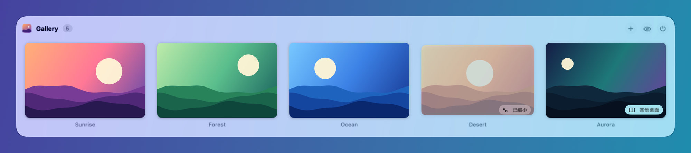
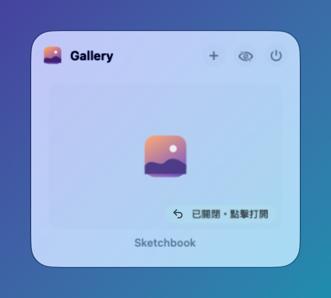
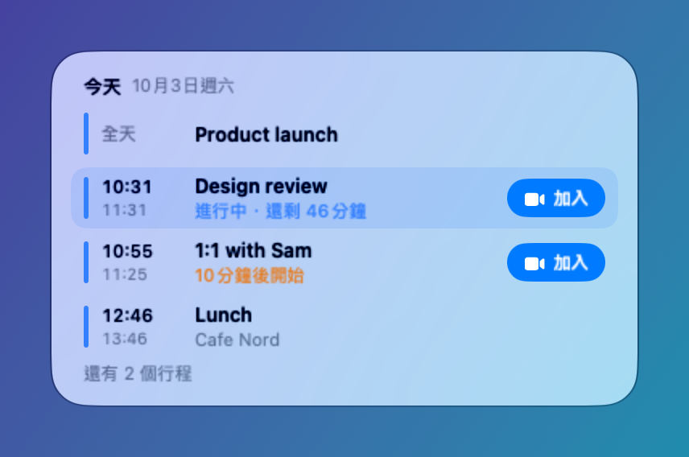
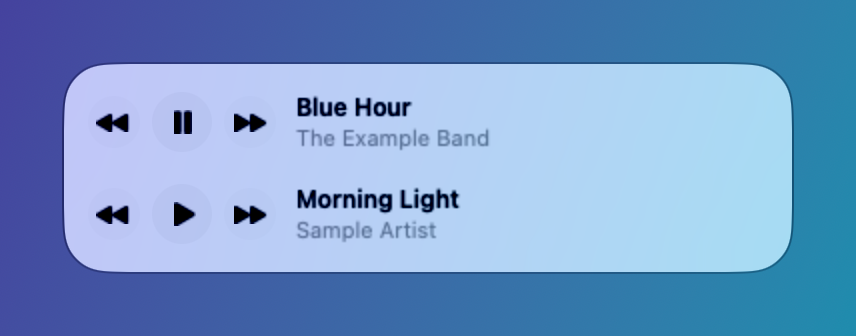
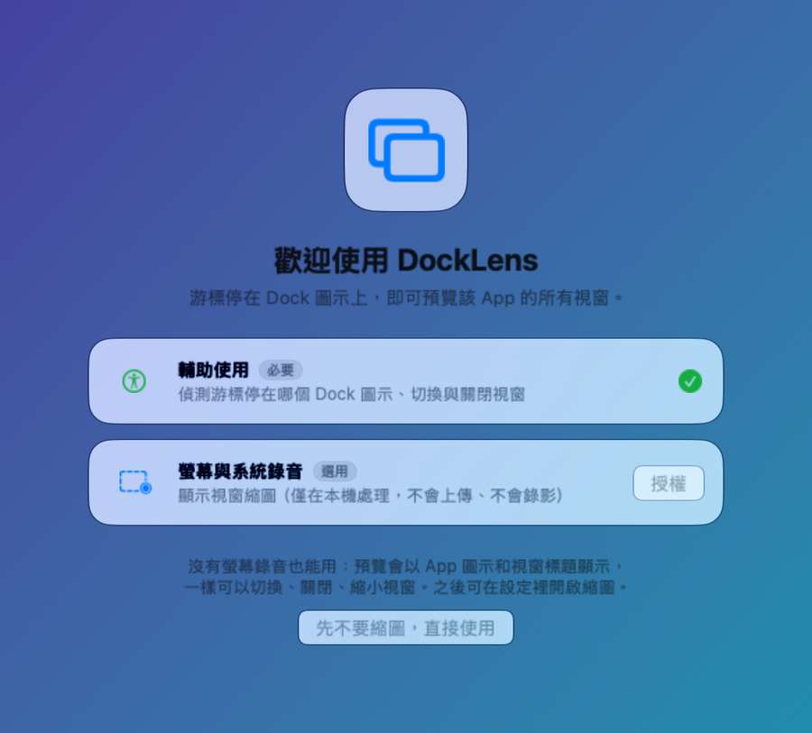
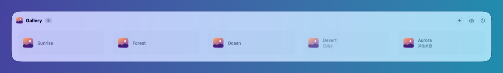

<p align="center">
  
</p>

<h1 align="center">DockLens</h1>

<p align="center">
  <b>游標停在 Dock 圖示上，就看到這個 App 的所有視窗。</b><br>
  即時縮圖，點一下切換；也能直接在預覽上關閉、縮小、全螢幕。<br>
  免費、開源（GPLv3）。
</p>

<p align="center">
  <a href="README.md">English</a> · 繁體中文
</p>

<p align="center">
  <a href="../../releases/latest"></a>
  
  <a href="LICENSE"></a>
</p>

<p align="center">
  <a href="../../releases/latest"><b>下載 DockLens.zip</b></a>
  &nbsp;·&nbsp;
  <code>brew install --cask firstfu/tap/docklens</code>
</p>

> [!NOTE]
> DockLens 需要 **macOS 26 以上**。目前**還沒有經過 Apple 公證**，所以第一次打開會被系統擋下：到「系統設定 › 隱私權與安全性」按一次「**強制打開**」即可（[步驟](#安裝)）。所有程式碼都在這裡，每項權限拿來做什麼也寫在[隱私](#隱私)一節。

<p align="center">
  
</p>

## 實際操作

<p align="center">
  
  <br>
  <sub>游標停在 Dock 圖示上，點縮圖切換，也能在預覽上關閉或縮小。</sub>
</p>

<p align="center">
  
  <br>
  <sub>已縮小的視窗和其他桌面上的視窗會加上標籤，點一下直接跳過去。</sub>
</p>

<table>
  <tr>
    <td width="50%" align="center"><br><sub><b>按 ✕ 關掉、App 卻還在執行？</b><br>Notion、Slack 這類 App 的視窗會留在清單裡，點一下重新打開。</sub></td>
    <td width="50%" align="center"><br><sub><b>行事曆行程。</b><br>今天，之後是明天；「進行中」「10 分鐘後開始」，Zoom、Meet、Teams 連結一鍵加入。</sub></td>
  </tr>
  <tr>
    <td align="center"><br><sub><b>播放列</b>：Spotify 與音樂的播放／暫停、上一首、下一首，並顯示目前的歌曲。</sub></td>
    <td align="center"><br><sub><b>螢幕錄製是選用的。</b><br>不給的話，預覽改以 App 圖示和視窗標題列出視窗。</sub></td>
  </tr>
</table>

<p align="center">
  
  <br>
  <sub>沒有螢幕錄製權限時，切換、關閉、縮小一樣可用。</sub>
</p>

## 安裝

**Homebrew**（[個人 tap](https://github.com/firstfu/homebrew-tap)）：

```sh
brew install --cask firstfu/tap/docklens
```

**或手動下載：**

1. 從 [Releases](../../releases/latest) 下載 `DockLens.zip` 並解壓縮
2. 把 `DockLens.app` 拖進「應用程式」資料夾
3. 打開它。第一次會被系統擋下（DockLens 還沒經過 Apple 公證）：到 **系統設定 → 隱私權與安全性**，往下捲，找到「已阻擋「DockLens」以保護你的Mac。」這行，按旁邊的 **強制打開**。每個版本只需要做一次。
4. 依歡迎視窗的引導開啟權限（見下表）

需要 **macOS 26 以上**。App 是 universal binary（Apple 晶片與 Intel 都能執行）。

### 更新

用新的 `DockLens.app` 取代「應用程式」裡的舊版，或在 tap 更新後執行 `brew upgrade --cask docklens`。從 1.0.4 起，每個版本都用同一張憑證簽章，**系統權限會保留**，新版只需要再按一次「強制打開」。
想知道有新版本：在選單列選單按「檢查更新…」、在設定打開「每週自動檢查更新」，或在這個頁面上方按 **Watch → Custom → Releases** 訂閱。

## 權限一覽

| 權限 | 是否必要 | 用途 | 不給的話 |
|---|---|---|---|
| **輔助使用** | 必要 | 偵測游標停在哪個 Dock 圖示；切換與關閉視窗 | DockLens 無法運作 |
| **螢幕錄製** | 選用 | 顯示即時縮圖（只在你的 Mac 上處理） | 預覽改以 App 圖示和視窗標題列出視窗 |
| **自動化**（Spotify／音樂） | 選用 | 播放列 | 沒有播放列；第一次按播放鈕時才會詢問 |
| **行事曆** | 選用 | 在行事曆圖示上顯示今天的行程 | 沒有行程；在那裡按「允許」時才會詢問 |

## 功能

- 游標停在 Dock 圖示上，即時顯示該 App 所有視窗的縮圖，點縮圖切換
- 在預覽上關閉、縮到 Dock／還原、全螢幕；標頭有開新視窗、隱藏 App、結束 App
- 會列出已縮小的視窗與其他桌面（Space）上的視窗，點一下會切到那個桌面
- 按 ✕ 關掉但 App 還開著的視窗（Notion、Slack 等）會保留在預覽裡，點一下重新打開
- **最近關閉**：剛在某個 App 關掉的文件（TextEdit、預覽程式等有檔案的 App）會列在它預覽的底部，點一下重新打開檔案
- 行事曆顯示今天，之後是明天的行程（行事曆沒開也行），視訊會議一鍵「加入」
- Spotify 與音樂的播放列
- 不給螢幕錄製也能用（以圖示加標題列出視窗）
- Dock 放底部、左側、右側都能用；支援自動隱藏、放大效果、多螢幕
- [34 種語言](#語言)，跟隨 macOS 的語言設定
- 事件驅動：閒置時 CPU 0%、0 次喚醒（Apple 晶片實測，記憶體約 20–30MB）

<details>
<summary>預覽上的單鍵快捷鍵</summary>

游標在預覽上時：**W** 關閉游標所在的視窗、**M** 縮小或還原、**H** 隱藏 App、**Q** 結束 App。其他鍵與 ⌘ 組合鍵照常輸入；不想用可以在設定關閉。
</details>

## 隱私

除非你要它檢查更新，DockLens **不會連網**。縮圖只在你的 Mac 上擷取與顯示，不會上傳。
唯一可能的連線是檢查更新：向 GitHub API 發一個請求讀取最新版本號，只在你按「檢查更新」或在設定打開「每週自動檢查更新」（預設關閉）時才發出，不送出任何關於你的資料。

「最近關閉」清單（你關掉的文件名稱）只存在記憶體：不寫入磁碟、不傳到任何地方，結束 DockLens 就消失。只記檔案，不記網頁。在設定關閉它，清單會立刻清空。

不用只聽我說：用到各權限的程式碼都在 [`DockLens/Core`](DockLens/Core)：`DockObserver.swift`（輔助使用：偵測游標停在哪個 Dock 圖示）、`ThumbnailService.swift`（螢幕錄製：縮圖）、`MediaController.swift`（自動化：Spotify／音樂）、`CalendarAgenda.swift`（行事曆：唯讀讀取行程），「最近關閉」的記憶體清單在 `ClosedWindowStore.swift`／`ClosedWindowWatcher.swift`，檢查更新在 `UpdateChecker.swift`。也可以用 Little Snitch、LuLu 等防火牆確認它沒有其他網路連線。

## 常見問題

<details>
<summary><b>游標停在 Dock 圖示上，預覽沒有出現</b></summary>

1. 確認「**輔助使用**」已允許：系統設定 → 隱私權與安全性 → 輔助使用，DockLens 要是開啟的。已經開著的話，先關再開一次。
2. 點選單列的 DockLens 圖示，確認「啟用視窗預覽」有勾選。
3. 預覽只會在 App 有視窗時出現（想要一律顯示，可在設定打開「App 沒有視窗時仍顯示面板」）。
4. 在圖示上多停一下：設定裡可以調整「顯示延遲」。
</details>

<details>
<summary><b>縮圖變成圖示和標題</b></summary>

那是沒有「**螢幕錄製**」權限時的模式。到 系統設定 → 隱私權與安全性 → 螢幕與系統錄音 允許 DockLens，或點選單列的「開啟視窗縮圖…」。
</details>

<details>
<summary><b>系統說「已阻擋『DockLens』以保護你的Mac」</b></summary>

DockLens 還沒有經過 Apple 公證。到 系統設定 → 隱私權與安全性，往下捲，按那行訊息旁的「**強制打開**」。每個版本只需要做一次。
</details>

<details>
<summary><b>更新後會失去權限嗎？</b></summary>

從 1.0.4 起不會：每個版本都用同一張憑證簽章，系統會保留你的權限。新版只需要再按一次「強制打開」。
</details>

<details>
<summary><b>怎麼解除安裝？</b></summary>

從選單列結束 DockLens，把 `DockLens.app` 從「應用程式」刪除（或 `brew uninstall --cask docklens`）；如果開過「登入時自動啟動」，也到 系統設定 → 一般 → 登入項目 移除。要連設定一起清掉：`defaults delete com.firstfu.DockLens`，並刪除 `~/Library/Caches/com.firstfu.DockLens`。
</details>

## 跟類似工具有什麼不同

[DockDoor](https://github.com/ejbills/DockDoor) 與 [AltTab](https://github.com/lwouis/alt-tab-macos) 都是成熟、優秀的工具。DockDoor 免費開源、功能更多（Alt+Tab 式切換、手勢、支援 macOS 13 以上與 Intel）。DockLens 比較小，而且需要 macOS 26。它多出來的是：按 ✕ 關掉但還在執行的視窗會留在清單、有按鈕可加入會議的行事曆行程，以及 34 種介面語言。需要 Alt+Tab 切換、手勢或較舊的 macOS，請用它們。

## 語言

34 種介面語言，依你的 macOS 語言設定。翻譯由 **AI 協助完成，不是每一種都經過母語者檢查**。哪裡不通順，歡迎用[翻譯勘誤表單](../../issues/new?template=translation.yml)或 pull request 指正（字串在 `DockLens/Resources/Localizable.xcstrings`）。**徵求母語者**：想幫忙檢查你的語言，請看 [issue #6](../../issues/6)。

<p align="center">
  
</p>

<details>
<summary>全部語言</summary>

العربية、Català、Čeština、Dansk、Deutsch、Ελληνικά、English、Español、Suomi、Français、עברית、हिन्दी、Hrvatski、Magyar、Bahasa Indonesia、Italiano、日本語、한국어、Bahasa Melayu、Norsk bokmål、Nederlands、Polski、Português（巴西）、Português（葡萄牙）、Română、Русский、Slovenčina、Svenska、ไทย、Türkçe、Українська、Tiếng Việt、简体中文、繁體中文。
</details>

## 考慮中的功能：請用 👍 投票

這些功能我**不會預先做**，要有人真的需要才做。如果有一項對你重要，請到對應的 Issue 按 👍，並留言說明**你會怎麼用**。

- Alt+Tab 式視窗切換、三指手勢開啟預覽、Windows 式工作列、支援 macOS 26 以前的系統（清單見 [Issues](../../issues?q=is%3Aissue+label%3Aconsidering)）

這是我一個人開發的小工具，想知道大家真正需要什麼。有問題或想要的功能，請開 [Issue](../../issues/new/choose) 告訴我。

## 從原始碼建置

需要 Xcode 26 與 [XcodeGen](https://github.com/yonaskolb/XcodeGen)（`brew install xcodegen`），指令見英文版的 [Build from source](README.md#build-from-source)。
預設為 ad-hoc 簽章，不需要 Apple 帳號；想用自己的憑證（重建後系統權限不必重開），請看 [`Config/Signing.xcconfig`](Config/Signing.xcconfig)。

## 同一位作者的其他作品

[Liftoff](https://github.com/firstfu/Liftoff)：macOS 26 拿掉的啟動台，現在回來了，還多了即時視窗預覽與一鍵智慧整理。免費、開源，適用 macOS 26 以上。

## 授權

[GPLv3](LICENSE)：可自由使用、研究、修改與散布；散布修改後的版本時，必須以同樣授權開源。
